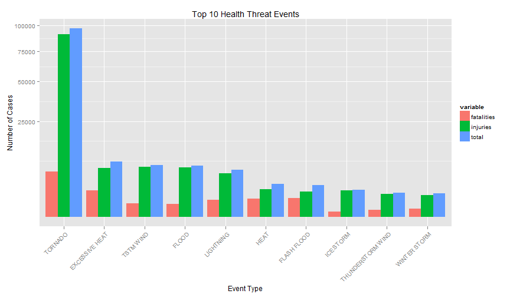

# The Most Harmful Weather Event in US

## 1. Synopsis
In US, storm and other weather events cause a large loss for both population 
health and economy every year.In order to reduce the loss and damage from these
disaster, it is important to find out which of them are the most harmful.
History information including time and geography data for each weather event occurrence data were collected by U.S. National Oceanic and Atmospheric 
Administration's (NOAA) storm database. In this paper, the database was 
downloaded and analysed to answer two question:

1. Across the United States, which types of events (as indicated in the EVTYPE 
variable) are most harmful with respect to population health?
2. Across the United States, which types of events have the greatest economic 
consequences?

## 2. Getting the data
[NOAA storm database](http://d396qusza40orc.cloudfront.net/repdata/data/StormData.csv.bz2) is downloaded from coursera web page. Cache is used to avoid repetition 
of downloading. 


```r
Sys.setlocale('LC_ALL', 'English')
```

```
## [1] "LC_COLLATE=English_United States.1252;LC_CTYPE=English_United States.1252;LC_MONETARY=English_United States.1252;LC_NUMERIC=C;LC_TIME=English_United States.1252"
```

```r
download.file("http://d396qusza40orc.cloudfront.net/repdata/data/StormData.csv.bz2", 
              "repdata-data-StormData.csv.bz2")
stormData <- read.csv("repdata-data-StormData.csv.bz2", sep=",", header=TRUE, 
                      stringsAsFactors=FALSE)
```

Take a look at the dataset, there are 4 columns are corresponding to health and economy loss:

1. `FATALTIES` ~ The number of fatalities caused by the events
2. `INJURIES` ~ The number of people injured by the events
3. `PROPDMG` ~ The amount of property loss by the events
4. `CROPDMG` ~ The amount of crop damage by the weather


```r
str(stormData)
```

```
## 'data.frame':	902297 obs. of  37 variables:
##  $ STATE__   : num  1 1 1 1 1 1 1 1 1 1 ...
##  $ BGN_DATE  : chr  "4/18/1950 0:00:00" "4/18/1950 0:00:00" "2/20/1951 0:00:00" "6/8/1951 0:00:00" ...
##  $ BGN_TIME  : chr  "0130" "0145" "1600" "0900" ...
##  $ TIME_ZONE : chr  "CST" "CST" "CST" "CST" ...
##  $ COUNTY    : num  97 3 57 89 43 77 9 123 125 57 ...
##  $ COUNTYNAME: chr  "MOBILE" "BALDWIN" "FAYETTE" "MADISON" ...
##  $ STATE     : chr  "AL" "AL" "AL" "AL" ...
##  $ EVTYPE    : chr  "TORNADO" "TORNADO" "TORNADO" "TORNADO" ...
##  $ BGN_RANGE : num  0 0 0 0 0 0 0 0 0 0 ...
##  $ BGN_AZI   : chr  "" "" "" "" ...
##  $ BGN_LOCATI: chr  "" "" "" "" ...
##  $ END_DATE  : chr  "" "" "" "" ...
##  $ END_TIME  : chr  "" "" "" "" ...
##  $ COUNTY_END: num  0 0 0 0 0 0 0 0 0 0 ...
##  $ COUNTYENDN: logi  NA NA NA NA NA NA ...
##  $ END_RANGE : num  0 0 0 0 0 0 0 0 0 0 ...
##  $ END_AZI   : chr  "" "" "" "" ...
##  $ END_LOCATI: chr  "" "" "" "" ...
##  $ LENGTH    : num  14 2 0.1 0 0 1.5 1.5 0 3.3 2.3 ...
##  $ WIDTH     : num  100 150 123 100 150 177 33 33 100 100 ...
##  $ F         : int  3 2 2 2 2 2 2 1 3 3 ...
##  $ MAG       : num  0 0 0 0 0 0 0 0 0 0 ...
##  $ FATALITIES: num  0 0 0 0 0 0 0 0 1 0 ...
##  $ INJURIES  : num  15 0 2 2 2 6 1 0 14 0 ...
##  $ PROPDMG   : num  25 2.5 25 2.5 2.5 2.5 2.5 2.5 25 25 ...
##  $ PROPDMGEXP: chr  "K" "K" "K" "K" ...
##  $ CROPDMG   : num  0 0 0 0 0 0 0 0 0 0 ...
##  $ CROPDMGEXP: chr  "" "" "" "" ...
##  $ WFO       : chr  "" "" "" "" ...
##  $ STATEOFFIC: chr  "" "" "" "" ...
##  $ ZONENAMES : chr  "" "" "" "" ...
##  $ LATITUDE  : num  3040 3042 3340 3458 3412 ...
##  $ LONGITUDE : num  8812 8755 8742 8626 8642 ...
##  $ LATITUDE_E: num  3051 0 0 0 0 ...
##  $ LONGITUDE_: num  8806 0 0 0 0 ...
##  $ REMARKS   : chr  "" "" "" "" ...
##  $ REFNUM    : num  1 2 3 4 5 6 7 8 9 10 ...
```

## 3. Data Processing
### 3.1 The most harmful events for public health
Top ten health threaten events ranked by total fataliteis and injuries.

```r
fatalities <- aggregate(stormData$FATALITIES, list(stormData$EVTYPE), sum)
injuries <- aggregate(stormData$INJURIES, list(stormData$EVTYPE), sum)
health <- merge(fatalities, injuries, by="Group.1")
health[,4] <- health[,2] + health[,3]
colnames(health) <- c("type", "fatalities", "injuries", "total")
healthtop <- health[order(health$total, decreasing=TRUE),][1:10,]
```

Plot the data

```r
library(reshape2)
healthtop_1 <- melt(healthtop, id.vars="type")

library(ggplot2)
ggplot(healthtop_1, aes(x = reorder(type, -value), y = value)) + 
    geom_bar(stat = "identity", aes(fill = variable), position = "dodge") + 
    scale_y_sqrt("Number of Cases") + xlab("Event Type") +
    theme(axis.text.x = element_text(angle = 45, hjust=1)) + 
    ggtitle("Top 10 Health Threat Events")
```

 

### 3.2 The most harmful events for economy
By examing the data, we find that the units for each row of property damage and 
corp damage are different, and there are huge gap between the range of property damage and corp damage. So it is more clear to demostrate them seperately. First, 
we need to make their units same. 


```r
unique(stormData$CROPDMGEXP)
```

```
## [1] ""  "M" "K" "m" "B" "?" "0" "k" "2"
```

```r
unique(stormData$PROPDMGEXP)
```

```
##  [1] "K" "M" ""  "B" "m" "+" "0" "5" "6" "?" "4" "2" "3" "h" "7" "H" "-"
## [18] "1" "8"
```

According to the [National Weather Service Storm Data Documentation](https://d396qusza40orc.cloudfront.net/repdata%2Fpeer2_doc%2Fpd01016005curr.pdf):

- "K"/ "k" stand for thousand
- "M"/ "m" stand for million
- "B"/ "b" stand for billion

So, we creat a new data frame `economy` to use the same units.

```r
economy <- stormData[,c("EVTYPE", "PROPDMG", "PROPDMGEXP", "CROPDMG", 
                        "CROPDMGEXP")]
index1 <- which(economy$PROPDMGEXP%in%c("K","k"))
index2 <- which(economy$PROPDMGEXP%in%c("M","m"))
index3 <- which(economy$PROPDMGEXP%in%c("B","b"))

economy[,2][index1] <- economy[,2][index1]*(10^3)
economy[,2][index2] <- economy[,2][index2]*(10^6)
economy[,2][index3] <- economy[,2][index3]*(10^9)
```

Use the same method for crop damage

```r
index4 <- which(economy$CROPDMGEXP%in%c("K","k"))
index5 <- which(economy$CROPDMGEXP%in%c("M","m"))
index6 <- which(economy$CROPDMGEXP%in%c("B","b"))

economy[,4][index4] <- economy[,4][index4]*(10^3)
economy[,4][index5] <- economy[,4][index5]*(10^6)
economy[,4][index6] <- economy[,4][index6]*(10^9)
```


```r
propertydmgs <- aggregate(economy$PROPDMG, list(economy$EVTYPE), sum)
corpdmgs <- aggregate(economy$CROPDMG, list(economy$EVTYPE), sum)
colnames(propertydmgs) <- c("type", "propertydmgs")
colnames(corpdmgs) <- c("type", "corpdmgs")

propertydmgstop <- propertydmgs[order(propertydmgs$propertydmgs, 
                                      decreasing=TRUE),][1:10,]
corpdmgstop <- corpdmgs[order(corpdmgs$corpdmgs, decreasing=TRUE),][1:10,]
```


```r
library(gridExtra)

plot2 <- ggplot(propertydmgstop, aes(x=reorder(type, -propertydmgs), 
                                     y=propertydmgs)) + 
    geom_bar(stat = "identity",  position = "dodge") + 
    scale_y_sqrt("Property Damage(US Dollar)") + xlab("Event Type") +
    theme(axis.text.x = element_text(angle = 45, hjust=1)) + 
    ggtitle("Top 10 Property Threat Events")

plot3 <- ggplot(corpdmgstop, aes(x=reorder(type, -corpdmgs), y=corpdmgs)) + 
    geom_bar(stat = "identity",  position = "dodge") + 
    scale_y_sqrt("Crop Damage(US Dollar)") + xlab("Event Type") +
    theme(axis.text.x = element_text(angle = 45, hjust=1)) + 
    ggtitle("Top 10 Crop Threat Events")

grid.arrange(plot2, plot3, ncol = 2)
```

 

### 3.3 Which part of US suffer most from the weather disaster?
Creat a dataframe `healthState` demostrating number of health threaten cases by 
state.

```r
healthState <- stormData[,c("STATE", "FATALITIES", "INJURIES")]
healthState[,4] <- healthState[,2] + healthState[,3]
colnames(healthState)[4] <- "TOTAL"
```


## 4. Result 
According to the 
